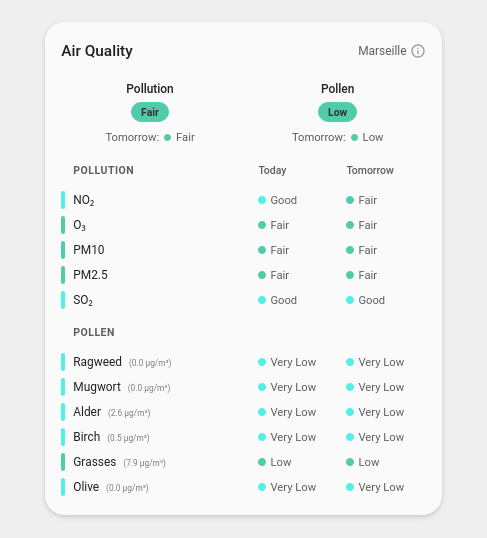

# Home Assistant Atmo France Card

[Readme en Français](README.fr.md)

Custom Lovelace card for the [Atmo France](https://github.com/sebcaps/atmofrance) Home Assistant integration. Displays air quality (pollution) and pollen data for French cities in a customizable card.

This project is independent and is not linked in anyway to the [Atmo France](https://github.com/sebcaps/atmofrance) Home Assistant integration or to Atmo France itself.



## Features

- **Auto-discovery** — no manual entity configuration needed; finds all atmofrance sensors automatically
- **Compact view** — two colored pills showing overall pollution and pollen levels
- **Expanded view** — detailed grid with all individual pollutants/pollen types, color bars, and level labels
- **Forecast** — optional forecast column
- **Bilingual** — French and English, auto-detected from Home Assistant locale
- **Visual editor** — full GUI configuration via the HA card editor
- **Conditional display** — optionally hide individual sensors when their level is good
- **Pollen concentrations** — optionally display concentration values

## Prerequisites

The [Atmo France integration](https://github.com/sebcaps/atmofrance) must be installed and configured via HACS. The card auto-discovers entities created by this integration.

## Installation

### HACS (recommended)

1. Open HACS in your Home Assistant instance
2. Click the three dots menu > **Custom repositories**
3. Add `https://github.com/sylvertom/atmofrance-card` with type **Dashboard**
4. Search for "Atmo France Card" and install it
5. Restart Home Assistant

### Manual

1. Download `atmofrance-card.js` from the [latest release](https://github.com/sylvertom/atmofrance-card/releases)
2. Copy it to your `config/www/` directory
3. Add the resource in **Settings > Dashboards > Resources**:

```yaml
resources:
  - url: /local/atmofrance-card.js
    type: module
```

4. Restart Home Assistant

## Configuration

Add the card to a dashboard view:

```yaml
type: custom:atmofrance-card
```

All configuration is optional — the card works with zero config.

### Options

| Option               | Type    | Default       | Description                                 |
|----------------------|---------|---------------|---------------------------------------------|
| `title`              | string  | `Atmo France` | Custom card title                           |
| `zone_name`          | string  | _(all zones)_ | Filter to a specific zone                   |
| `show_pollution`     | boolean | `true`        | Show pollution section                      |
| `show_pollen`        | boolean | `true`        | Show pollen section                         |
| `show_forecast`      | boolean | `true`        | Show J+1 forecast column                    |
| `hide_when_good`     | boolean | `true`        | Hide individual sensors when their level is good |
| `show_details`       | boolean | `true`        | Show expanded view with individual sensors  |
| `show_concentration` | boolean | `false`       | Show pollen concentration values            |

### Example

```yaml
type: custom:atmofrance-card
title: "Air Quality"
show_forecast: true
hide_when_good: true
show_details: true
show_concentration: true
```

## How it works

The card scans `hass.states` for sensors with the distinctive attributes `Couleur` and `Nom de la zone` that the Atmo France integration provides. It classifies entities as:

- **Pollution vs Pollen** — by entity ID keywords (`dioxyde_d_azote`, `ozone`, `pm10`, etc. vs `niveau_ambroisie`, `niveau_armoise`, etc.)
- **Today vs Forecast** — entity ID contains `_j_1` or friendly name contains `J+1`
- **Level vs Concentration** — concentration entities have `µg/m³` unit or `concentration_` prefix

## Sensors displayed

### Pollution

| Sensor          | Entity pattern        |
|-----------------|-----------------------|
| Overall Quality | `qualite_globale`     |
| NO2             | `dioxyde_d_azote`     |
| O3              | `ozone`               |
| PM10            | `pm10`                |
| PM2.5           | `pm25`                |
| SO2             | `dioxyde_de_soufre`   |

### Pollen

| Sensor                | Entity pattern            |
|-----------------------|---------------------------|
| Overall Quality       | `qualite_globale_pollen`  |
| Ragweed (Ambroisie)   | `niveau_ambroisie`        |
| Mugwort (Armoise)     | `niveau_armoise`          |
| Alder (Aulne)         | `niveau_aulne`            |
| Birch (Bouleau)       | `niveau_bouleau`          |
| Grasses (Graminees)   | `niveau_gramine`          |
| Olive (Olivier)       | `niveau_olivier`          |

## Development

```bash
npm install
npm run build     # one-time build
npm run watch     # rebuild on changes
```

## License

MIT - see [LICENSE](LICENSE).
